# Hibernate/JPA Architecture

## 🏗️ Tổng quan kiến trúc Hibernate


---

## 🔄 Lifecycle của Session/EntityManager


---

## 📊 Entity States (Trạng thái Entity)

```mermaid
stateDiagram-v2
    [*] --> Transient: new Entity()
    
    Transient --> Managed: persist()
    Managed --> Detached: detach() / close()
    Managed --> Removed: remove()
    Removed --> Managed: persist()
    Detached --> Managed: merge()
    
    Managed --> [*]: Database sync on flush
    Removed --> [*]: DELETE on flush
    
    note right of Transient
        Chưa được track
        Không có ID
    end note
    
    note right of Managed
        Được PersistenceContext track
        Changes auto-detected
    end note
    
    note right of Detached
        Có ID nhưng không tracked
        Cần merge() để re-attach
    end note
    
    note right of Removed
        Marked for deletion
        DELETE khi flush
    end note
```



---

## 🧩 Core Components

### 1. Configuration / Metadata

```mermaid
graph LR
    subgraph "Configuration Sources"
        XML[hibernate.cfg.xml]
        PROP[hibernate.properties]
        ANNO[@Entity Annotations]
    end
    
    subgraph "Metadata Model"
        PC[PersistentClass]
        PM[PropertyMapping]
        ID[IdentifierGenerator]
        TYPE[TypeDefinitions]
    end
    
    XML --> META[MetadataBuilder]
    PROP --> META
    ANNO --> META
    
    META --> PC
    META --> PM
    META --> ID
    META --> TYPE
```

### 2. SessionFactory Internal


### 3. Session Internal


---

## 🔧 Mini-Hibernate Architecture (Simplified)


---

## 📋 Component Responsibilities

| Component | Hibernate | Mini-Hibernate | Responsibility |
|-----------|-----------|----------------|----------------|
| Configuration | `Configuration`, `StandardServiceRegistry` | `MiniConfiguration` | Load settings, mappings |
| SessionFactory | `SessionFactoryImpl` | `MiniSessionFactory` | Heavy-weight, thread-safe, creates Sessions |
| Session | `SessionImpl` | `MiniSession` | Unit of work, manages entities |
| PersistenceContext | `StatefulPersistenceContext` | `MiniPersistenceContext` | First-level cache, entity tracking |
| EntityPersister | `AbstractEntityPersister` | `EntityPersister` | CRUD operations for entity type |
| SQL Generator | `Dialect`, `SQLQueryParser` | `SQLGenerator` | Generate SQL statements |
| Type System | `Type`, `BasicTypeRegistry` | `TypeConverter` | Java ↔ SQL type conversion |

---

## 🔀 Request Flow: persist(entity)


---

## 🧠 Key Design Patterns Used

| Pattern | Usage in Hibernate | Mini-Hibernate Implementation |
|---------|-------------------|-------------------------------|
| **Factory** | SessionFactory creates Session | `MiniSessionFactory.openSession()` |
| **Unit of Work** | Session tracks changes, flush at end | `MiniSession` + `MiniPersistenceContext` |
| **Identity Map** | One instance per entity per session | `Map<EntityKey, Entity>` in PersistenceContext |
| **Proxy** | Lazy loading entities | Dynamic Proxy hoặc ByteBuddy |
| **Strategy** | Dialect for different databases | `SQLDialect` interface |
| **Observer** | Event listeners (pre/post insert) | `EventListener` interfaces |
| **Template Method** | AbstractEntityPersister | Base persister class |
