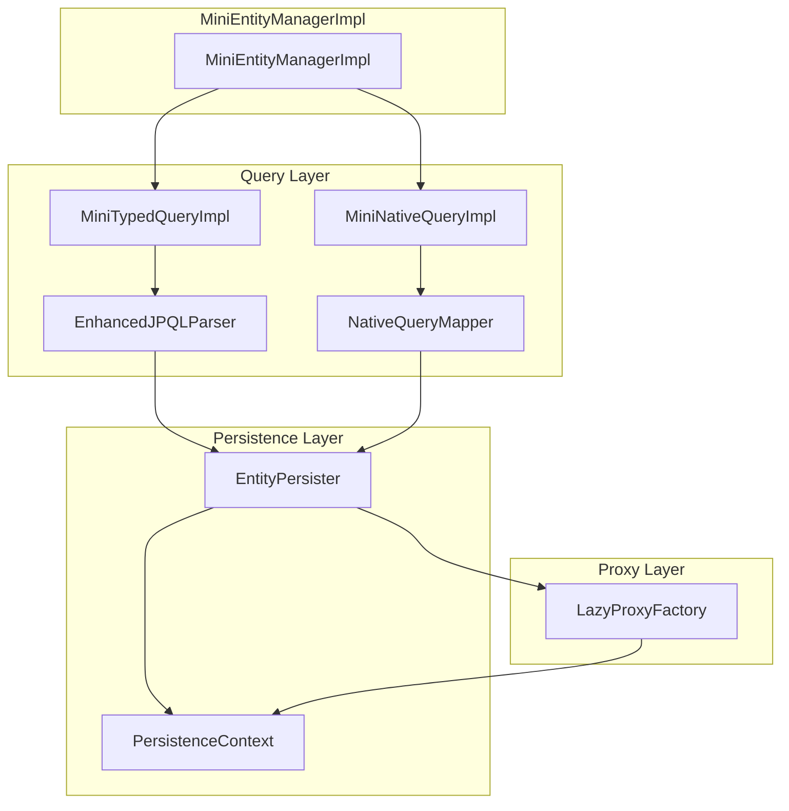
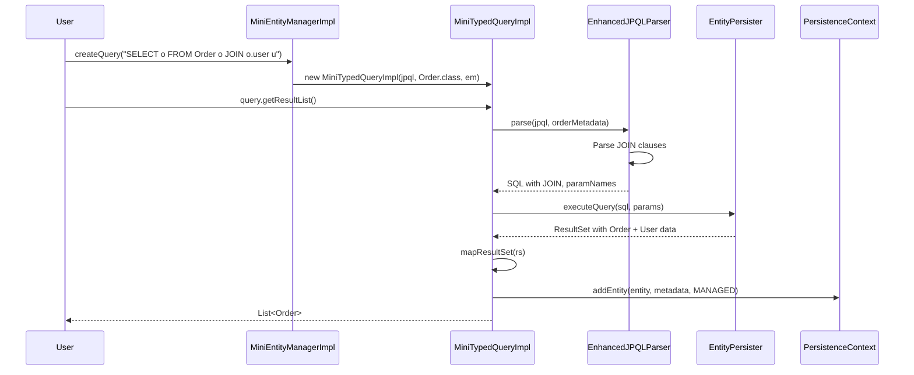
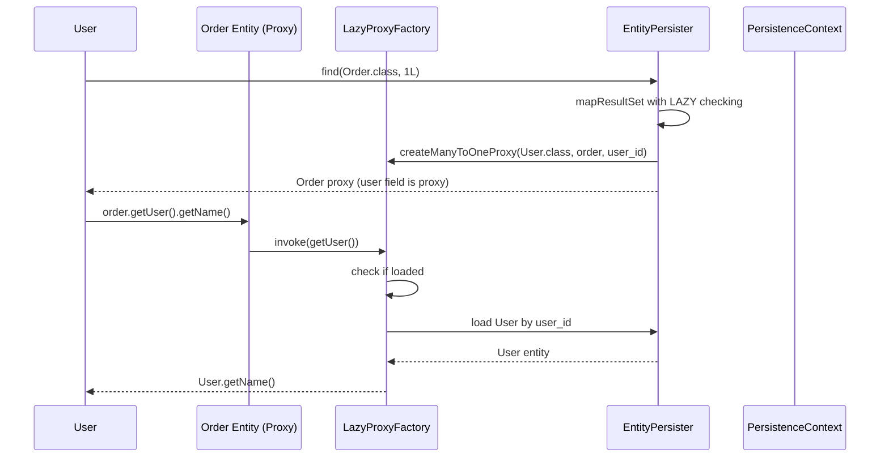
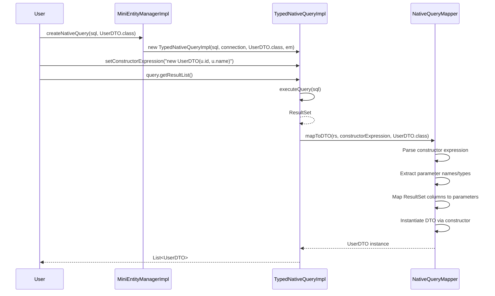

# Mini-Hibernate Architecture Document: JPQL Enhancement, Native Query Mapping & Lazy Loading

## Table of Contents
1. [Executive Summary](#executive-summary)
2. [Current State Analysis](#current-state-analysis)
3. [JPQL Enhancement Architecture](#jpql-enhancement-architecture)
4. [Native Query Mapping Architecture](#native-query-mapping-architecture)
5. [Lazy Loading Architecture](#lazy-loading-architecture)
6. [Integration Design](#integration-design)
7. [Implementation Roadmap](#implementation-roadmap)
8. [Dependencies & Risks](#dependencies--risks)

---

## 1. Executive Summary

This document outlines the architecture and implementation plan for three major enhancements to Mini-Hibernate:

1. **JPQL Enhancement**: Full support for JOIN operations, GROUP BY, HAVING, ORDER BY, aggregation functions, and DISTINCT
2. **Native Query Mapping**: Complete entity mapping, DTO/projection mapping with constructor expressions, and @SqlResultSetMapping support
3. **Lazy Loading**: Full FetchType (LAZY/EAGER) support, proxy generation, and bytecode enhancement integration

---

## 2. Current State Analysis

### 2.1 Existing Components

```
mini-hibernate/
├── src/main/java/org/ltl/minihibernate/
│   ├── metadata/                          # Metadata layer
│   │   ├── MetadataParser.java           # Entity annotation parsing
│   │   ├── EntityMetadata.java           # Entity metadata container
│   │   ├── FieldMetadata.java            # Field metadata with relationship info
│   │   └── RelationshipType.java         # NONE, MANY_TO_ONE, ONE_TO_MANY, etc.
│   │
│   ├── query/                            # Query layer
│   │   ├── SimpleJPQLParser.java        # Basic JPQL parser (prototype)
│   │   ├── EnhancedJPQLParser.java      # Enhanced parser (work in progress)
│   │   └── MiniQuery.java               # Query interface
│   │
│   ├── internal/                         # Internal implementations
│   │   ├── NativeQueryMapper.java       # Basic native query mapping
│   │   ├── LazyProxyFactory.java        # Prototype proxy factory
│   │   ├── MiniTypedQueryImpl.java      # Typed query implementation
│   │   ├── MiniNativeQueryImpl.java     # Native query implementation
│   │   └── TypedNativeQueryImpl.java    # Typed native query
│   │
│   ├── persist/                          # Persistence layer
│   │   ├── EntityPersister.java         # CRUD operations
│   │   ├── PersistenceContext.java      # First-level cache
│   │   └── EntityKey.java               # Entity identity key
│   │
│   └── session/                          # Session management
│       └── EntityState.java             # Transient, Managed, Detached, Removed
```

### 2.2 Current Implementation Status

| Feature | Status | Notes |
|---------|--------|-------|
| Basic JPQL (SELECT FROM WHERE) | ✅ Complete | SimpleJPQLParser |
| Enhanced JPQL Parser | ⚠️ Partial | EnhancedJPQLParser exists, JOINs incomplete |
| Native Query Mapping (Entity) | ✅ Complete | NativeQueryMapper.mapToEntity() |
| Native Query Mapping (DTO) | ✅ Complete | NativeQueryMapper.mapToDTO() |
| LazyProxyFactory | ⚠️ Prototype | ManyToOneInvocationHandler exists, incomplete |
| FetchType Annotation | ✅ Complete | Parsed in MetadataParser |
| GROUP BY/HAVING | ⚠️ Partial | Parser support exists, integration incomplete |
| Aggregation Functions | ⚠️ Partial | COUNT/SUM/AVG/MAX/MIN supported in parser |
| @SqlResultSetMapping | ❌ Not Implemented | Not yet defined |

### 2.3 Key Integration Points

```
MiniEntityManagerImpl
    │
    ├── createQuery() → MiniTypedQueryImpl
    │                    └── EnhancedJPQLParser.parse()
    │
    ├── createNativeQuery() → MiniNativeQueryImpl
    │                         └── NativeQueryMapper
    │
    └── find() → EntityPersister.load()
                 └── LazyProxyFactory (for LAZY relationships)
```

---

## 3. JPQL Enhancement Architecture

### 3.1 Enhanced JPQL Parser Design

#### Current Architecture (EnhancedJPQLParser)

```
EnhancedJPQLParser.java (672 lines)
├── JPQL_PATTERN - Main regex pattern
├── SELECT_PATTERN - Select clause parsing
├── WHERE_PATTERN - Where clause parsing
├── JOIN_PATTERN - Join clause parsing
├── AGG_PATTERN - Aggregation function pattern
│
├── parse(jpql, metadata) - Main entry point
├── parseSelectClause() - SELECT clause processing
├── parseFromClause() - FROM clause processing
├── parseJoins() - JOIN generation
├── parseWhereClause() - WHERE with operators
├── parseHavingClause() - HAVING clause
├── parseGroupByOrderBy() - GROUP BY / ORDER BY
└── parseJoinCondition() - ON condition parsing
```

#### Proposed Architecture

```
org.ltl.minihibernate.query/
├── JPQLParser.java (Facade - interface)
├── EnhancedJPQLParser.java (Current implementation → renamed to DefaultJPQLParser)
├── JPQLParseResult.java (DTO containing parsed result)
├── clause/
│   ├── SelectClauseParser.java
│   ├── FromClauseParser.java
│   ├── Where│   ├── GroupClauseParser.java
ByClauseParser.java
│   ├── HavingClauseParser.java
│   └── OrderByClauseParser.java
├── function/
│   ├── AggregationFunctionParser.java
│   └── NativeFunctionParser.java
└── join/
    ├── JoinClauseParser.java
    ├── JoinPathResolver.java
    └── JoinConditionParser.java
```

### 3.2 JPQL Grammar Support

#### Supported Syntax

```jpql
-- Basic SELECT
SELECT u FROM User u
SELECT DISTINCT u FROM User u WHERE u.age > :age

-- JOIN operations
SELECT o FROM Order o JOIN o.user u
SELECT o FROM Order o LEFT JOIN o.user u
SELECT o FROM Order o INNER JOIN o.user u
SELECT o FROM Order o RIGHT JOIN o.user u ON o.user_id = u.id

-- GROUP BY / HAVING
SELECT u.age, COUNT(u) FROM User u GROUP BY u.age HAVING COUNT(u) > 1

-- ORDER BY
SELECT u FROM User u ORDER BY u.age DESC, u.name ASC

-- Aggregation functions
SELECT COUNT(u), SUM(u.age), AVG(u.age), MAX(u.age), MIN(u.age) FROM User u
SELECT COUNT(DISTINCT u.name) FROM User u
```

### 3.3 JOIN Resolution Strategy

```java
// Current: Simple relationship lookup
EntityMetadata relatedMetadata = findRelatedEntityMetadata(entityName, metadata);

// Proposed: Enhanced path resolution
JoinPathResolver pathResolver = new JoinPathResolver(metadata);
JoinPath path = pathResolver.resolveJoinPath("o.user");  // Order → User
EntityMetadata targetMetadata = path.getTargetMetadata();
String targetTable = targetMetadata.getTableName();
String targetAlias = generateAlias(targetTable);
String joinCondition = buildJoinCondition(path, mainAlias, targetAlias);
```

### 3.4 Integration with MiniTypedQueryImpl

```java
// Current
private String buildSQL() {
    if (jpql != null) {
        EnhancedJPQLParser.ParsedQuery pq = EnhancedJPQLParser.parse(jpql, metadata);
        // ... LIMIT/OFFSET handling
        return pq.sql;
    }
}

// Proposed
private String buildSQL() {
    if (jpql != null) {
        JPQLParser parser = JPQLParserFactory.createParser();
        JPQLParseResult result = parser.parse(jpql, metadata);
        
        // Handle result transformation for aggregations
        if (result.isAggregate()) {
            return transformAggregateResult(result);
        }
        
        // Add pagination
        result = result.withLimit(maxResults).withOffset(firstResult);
        return result.getSQL();
    }
}
```

---

## 4. Native Query Mapping Architecture

### 4.1 Current Implementation Analysis

#### NativeQueryMapper (273 lines)

```java
public class NativeQueryMapper {
    private final MetadataParser metadataParser;
    private final Map<Class<?>, EntityMetadata> metadataCache;
    
    public <T> T mapToEntity(ResultSet rs, Class<T> entityClass)
    public <T> T mapToDTO(ResultSet rs, String constructorExpression, Class<T> dtoClass)
    public <T extends Map<String, Object>> T mapToMap(ResultSet rs, T result)
}
```

#### TypedNativeQueryImpl (179 lines)

```java
public class TypedNativeQueryImpl<T> extends MiniNativeQueryImpl {
    private final Class<T> resultClass;
    private final NativeQueryMapper mapper;
    
    public List<T> getResultList()  // Maps based on entityClass/constructorExpression
    public List<T> getEntityResultList()  // Registers in persistence context
}
```

### 4.2 Proposed Architecture

```
org.ltl.minihibernate.mapping/
├── NativeQueryMapper.java (Enhanced)
│
├── result/
│   ├── ResultSetMapper.java (Interface)
│   ├── EntityResultMapper.java (Entity mapping)
│   ├── DtoResultMapper.java (Constructor expression mapping)
│   ├── ScalarResultMapper.java (Primitive types)
│   └── ColumnAliasMapper.java (Result set column → field mapping)
│
├── annotation/
│   ├── SqlResultSetMapping.java (Annotation definition)
│   ├── EntityResult.java
│   ├── ColumnResult.java
│   └── FieldResult.java
│
└── transformer/
    ├── ResultTransformer.java (Interface)
    ├── AutoTransformer.java (Automatic type detection)
    └── ConstructorTransformer.java (Constructor expression)
```

### 4.3 @SqlResultSetMapping Support

#### Proposed Annotation Definitions

```java
// In annotation package
@Target({TYPE})
@Retention(RUNTIME)
public @interface SqlResultSetMapping {
    String name();
    EntityResult[] entities() default {};
    ColumnResult[] columns() default {};
}

@Target({TYPE})
@Retention(RUNTIME)
public @interface EntityResult {
    Class<?> entityClass();
    String discriminatorColumn() default "";
    FieldResult[] fieldResults() default {};
}

@Target({TYPE})
@Retention(RUNTIME)
public @interface FieldResult {
    String name();
    String column();
}

@Target({TYPE})
@Retention(RUNTIME)
public @interface ColumnResult {
    String name();
    Class<?> type() default void.class;
}
```

### 4.4 Constructor Expression Support

```java
// Current: Simple parsing
ConstructorExpression expr = parseConstructorExpression(constructorExpression);

// Proposed: Enhanced with type inference
ConstructorExpression expr = parseConstructorExpression(constructorExpression);

// Type inference improvements
TypeInferenceResult inferred = inferParameterTypes(
    expr.getParamNames(), 
    resultSetMetaData,
    entityMetadata
);

// Constructor matching
Constructor<T> constructor = findMatchingConstructor(
    dtoClass,
    inferred.getParameterTypes()
);
```

### 4.5 Integration Points

```java
// MiniEntityManagerImpl - createNativeQuery overloads
public Query createNativeQuery(String sqlString, String resultSetMapping) {
    SqlResultSetMapping mapping = resolveMapping(resultSetMapping);
    return new NativeQueryImpl(sqlString, connection, mapping);
}

public <T> Query createNativeQuery(String sqlString, Class<T> resultClass) {
    return new NativeQueryImpl(sqlString, connection, resultClass);
}
```

---

## 5. Lazy Loading Architecture

### 5.1 Current Implementation Analysis

#### LazyProxyFactory (271 lines)

```java
public class LazyProxyFactory {
    private final MetadataParser metadataParser;
    private final BiFunction<Class<?>, Object, Object> entityLoader;
    
    // ManyToOne proxy
    public <T> T createManyToOneProxy(Class<T> targetClass, Object ownerEntity,
                                      FieldMetadata foreignKeyField)
    
    // OneToMany collection proxy
    public <T extends Collection<E>, E> T createCollectionProxy(...)
    
    // Entity proxy for dirty checking
    public <T> T createEntityProxy(T entity, Class<T> entityClass)
}
```

#### Invocation Handlers

```java
private class ManyToOneInvocationHandler implements InvocationHandler {
    private volatile Object target;
    private volatile boolean loaded;
    
    public Object invoke(Object proxy, Method method, Object[] args) {
        if (loaded) return method.invoke(target, args);
        loadTarget();  // Synchronized loading
        return method.invoke(target, args);
    }
}

private class OneToManyInvocationHandler implements InvocationHandler {
    private volatile List<?> target;
    private volatile boolean loaded;
    
    // Triggers: iterator(), size(), isEmpty(), contains(), etc.
    public Object invoke(Object proxy, Method method, Object[] args) {
        if (methodName.equals("iterator") || ... ) {
            loadCollection();
            return method.invoke(target, args);
        }
    }
}
```

### 5.2 Proposed Architecture

```
org.ltl.minihibernate.proxy/
├── LazyProxyFactory.java (Enhanced)
│
├── handler/
│   ├── ManyToOneInvocationHandler.java
│   ├── OneToManyInvocationHandler.java
│   ├── ManyToManyInvocationHandler.java
│   └── OneToOneInvocationHandler.java
│
├── collection/
│   ├── PersistentList.java
│   ├── PersistentSet.java
│   ├── PersistentBag.java
│   └── CollectionInitializer.java
│
├── initializer/
│   ├── EntityInitializer.java
│   ├── CollectionInitializer.java
│   └── AbstractInitializer.java
│
└── bytecode/
    ├── BytecodeEnhancer.java (Future)
    └── EnhancementStrategy.java (Future)
```

### 5.3 Fetch Type Resolution

```java
// MetadataParser already extracts fetch type
private void parseRelationships(Field field, FieldMetadata.Builder builder) {
    ManyToOne manyToOne = field.getAnnotation(ManyToOne.class);
    if (manyToOne != null) {
        builder.fetchType(manyToOne.fetch());  // LAZY or EAGER
        builder.isLazy(manyToOne.fetch() == jakarta.persistence.FetchType.LAZY);
    }
}
```

### 5.4 PersistenceContext Integration

```java
// Current: Simple entity caching
public void addEntity(Object entity, EntityMetadata metadata, EntityState state) {
    Object id = metadata.getId(entity);
    EntityKey key = new EntityKey(entity.getClass(), id);
    entityMap = entityMap.put(key, entity);
    // ...
}

// Proposed: Enhanced with proxy support
public void addEntity(Object entity, EntityMetadata metadata, EntityState state) {
    // Unwrap proxies if necessary
    Object unwrapped = unwrapProxy(entity);
    if (unwrapped != entity) {
        entity = unwrapped;
    }
    
    Object id = metadata.getId(entity);
    EntityKey key = new EntityKey(entity.getClass(), id);
    entityMap = entityMap.put(key, entity);
    // ...
}

// Proxy unwrapping for identity map
private Object unwrapProxy(Object entity) {
    if (Proxy.isProxyClass(entity.getClass())) {
        InvocationHandler handler = Proxy.getInvocationHandler(entity);
        if (handler instanceof EntityInvocationHandler) {
            return ((EntityInvocationHandler) handler).getTarget();
        }
    }
    return entity;
}
```

### 5.5 EntityPersister Integration

```java
// Current: Basic lazy loading check
private Object mapResultSet(ResultSet rs, EntityMetadata metadata,
    BiFunction<Class<?>, Object, Object> relationResolver,
    boolean useLazyLoading,
    Function<Class<?>, FieldMetadata> fkLookup) throws SQLException {
    
    for (FieldMetadata field : metadata.getPersistableFields()) {
        if (field.isManyToOne() && value != null) {
            if (useLazyLoading && field.getFetchType() == FetchType.LAZY) {
                // Create lazy proxy
                field.setValue(entity, createLazyProxy(field, value));
            } else {
                // Eager loading - resolve immediately
                value = relationResolver.apply(field.getTargetEntity(), value);
            }
        }
    }
}

// Proposed: Enhanced with proxy factory integration
private Object mapResultSet(ResultSet rs, EntityMetadata metadata,
    BiFunction<Class<?>, Object, Object> relationResolver,
    boolean useLazyLoading) throws SQLException {
    
    Object entity = metadata.newInstance();
    
    for (FieldMetadata field : metadata.getPersistableFields()) {
        Object value = rs.getObject(field.getColumnName());
        
        if (field.isRelationship()) {
            if (useLazyLoading && field.getFetchType() == FetchType.LAZY) {
                // Create appropriate proxy based on relationship type
                Object proxy = createRelationshipProxy(field, entity, value);
                field.setValue(entity, proxy);
            } else {
                // Eager loading
                value = convertType(value, field.getJavaType());
                if (field.isManyToOne()) {
                    value = relationResolver.apply(field.getTargetEntity(), value);
                }
            }
        } else {
            value = convertType(value, field.getJavaType());
        }
        
        field.setValue(entity, value);
    }
    
    return entity;
}
```

### 5.6 Bytecode Enhancement (Future)

```java
// BytecodeEnhancer.java - For production use
public class BytecodeEnhancer {
    public byte[] enhance(Class<?> entityClass) {
        // Use Byte Buddy or Javassist
        // Add interceptors for field access
        // Generate subclass with lazy loading hooks
    }
}
```

---

## 6. Integration Design

### 6.1 Component Interaction Diagram



### 6.2 Data Flow for JPQL Query with JOIN



### 6.3 Data Flow for Lazy Loading



### 6.4 Data Flow for Native Query with DTO Mapping



---

## 7. Implementation Roadmap

### Phase 1: JPQL Enhancement

#### Week 1-2: Core Parser Improvements

| Task | File | Description |
|------|------|-------------|
| 1.1 | `EnhancedJPQLParser.java` | Refactor and complete JOIN parsing |
| 1.2 | `JPQLParseResult.java` | Create DTO for parse results |
| 1.3 | `JoinPathResolver.java` | New - Resolve entity relationships for JOINs |
| 1.4 | `MiniTypedQueryImpl.java` | Update to use enhanced parser |
| 1.5 | `EnhancedJPQLParserTest.java` | Add comprehensive tests |

#### Week 3: GROUP BY / HAVING / ORDER BY

| Task | File | Description |
|------|------|-------------|
| 1.6 | `GroupByClauseParser.java` | New - Dedicated GROUP BY parser |
| 1.7 | `HavingClauseParser.java` | New - Dedicated HAVING parser |
| 1.8 | `OrderByClauseParser.java` | New - Dedicated ORDER BY parser |
| 1.9 | `MiniTypedQueryImpl.java` | Update result handling for aggregations |
| 1.10 | Tests | Integration tests for GROUP BY/HAVING |

### Phase 2: Native Query Mapping

#### Week 4-5: Core Mapping Infrastructure

| Task | File | Description |
|------|------|-------------|
| 2.1 | `annotation/SqlResultSetMapping.java` | New - Annotation definition |
| 2.2 | `annotation/EntityResult.java` | New - Entity result annotation |
| 2.3 | `annotation/FieldResult.java` | New - Field result annotation |
| 2.4 | `annotation/ColumnResult.java` | New - Column result annotation |
| 2.5 | `NativeQueryMapper.java` | Enhance with @SqlResultSetMapping support |

#### Week 6: DTO/Projection Mapping

| Task | File | Description |
|------|------|-------------|
| 2.6 | `ConstructorExpressionParser.java` | New - Enhanced constructor parsing |
| 2.7 | `DtoResultMapper.java` | New - Dedicated DTO mapping |
| 2.8 | `TypeInferenceEngine.java` | New - Improved type inference |
| 2.9 | `MiniEntityManagerImpl.java` | Add createNativeQuery overloads |
| 2.10 | Tests | DTO mapping integration tests |

### Phase 3: Lazy Loading

#### Week 7-8: Core Proxy Implementation

| Task | File | Description |
|------|------|-------------|
| 3.1 | `LazyProxyFactory.java` | Complete ManyToOne proxy implementation |
| 3.2 | `ManyToOneInvocationHandler.java` | Extract and enhance handler |
| 3.3 | `OneToManyInvocationHandler.java` | Complete collection proxy |
| 3.4 | `CollectionInitializer.java` | New - Initialize collections on access |
| 3.5 | `EntityPersister.java` | Integrate proxy creation in mapResultSet |

#### Week 9: PersistenceContext Integration

| Task | File | Description |
|------|------|-------------|
| 3.6 | `PersistenceContext.java` | Add proxy unwrapping in identity map |
| 3.7 | `MiniEntityManagerImpl.java` | Update find() to support lazy loading |
| 3.8 | `EntityKey.java` | Ensure proxy handling in equals/hashCode |
| 3.9 | Tests | Lazy loading integration tests |

#### Week 10 (Optional): Bytecode Enhancement

| Task | File | Description |
|------|------|-------------|
| 3.10 | `BytecodeEnhancer.java` | New - Future bytecode enhancement |
| 3.11 | `EnhancementStrategy.java` | New - Strategy pattern for enhancement |

### Phase 4: Integration & Testing

#### Week 11-12: Integration

| Task | File | Description |
|------|------|-------------|
| 4.1 | All components | Full integration testing |
| 4.2 | `JPQLFeaturesDemo.java` | Update demos |
| 4.3 | `NativeQueryMappingDemo.java` | Update demos |
| 4.4 | `docs/` | Update architecture documentation |
| 4.5 | `MiniHibernateDemo.java` | End-to-end demo |

---

## 8. Dependencies & Risks

### 8.1 Internal Dependencies

```
JPQL Enhancement
├── Depends on: MetadataParser (complete)
├── Depends on: FieldMetadata relationship info (complete)
└── Integration: MiniTypedQueryImpl, EntityPersister

Native Query Mapping
├── Depends on: NativeQueryMapper (complete)
├── Depends on: SqlResultSetMapping annotations (new)
└── Integration: MiniEntityManagerImpl, TypedNativeQueryImpl

Lazy Loading
├── Depends on: LazyProxyFactory (prototype)
├── Depends on: FieldMetadata fetchType (complete)
└── Integration: EntityPersister, PersistenceContext
```

### 8.2 External Dependencies

| Dependency | Version | Purpose |
|------------|---------|---------|
| Jakarta Persistence | 3.2.0 | JPA API |
| Vavr | 0.10.4 | Functional programming |
| H2 Database | 2.2.x | In-memory database for testing |
| JUnit 5 | 5.10.x | Testing |
| Mockito | 5.7.x | Mocking |

### 8.3 Risks & Mitigation

| Risk | Impact | Mitigation |
|------|--------|------------|
| JOIN parsing complexity | High | Start with simple path expressions, add complex cases incrementally |
| DTO mapping edge cases | Medium | Comprehensive test coverage, graceful error handling |
| Proxy serialization | Medium | Implement readResolve() for proper serialization |
| Performance with lazy loading | Low | Add metrics, optimize proxy creation |
| Circular dependencies in proxies | Medium | Proper synchronization, break detection |

### 8.4 Success Criteria

#### JPQL Enhancement
- ✅ All test cases in `EnhancedJPQLParserTest.java` pass
- ✅ JOIN queries work with Order → User relationship
- ✅ GROUP BY/HAVING with aggregations return correct results
- ✅ ORDER BY supports multiple columns with ASC/DESC

#### Native Query Mapping
- ✅ `@SqlResultSetMapping` annotation works
- ✅ Constructor expressions map to DTOs correctly
- ✅ Entity mapping with column aliasing works
- ✅ Scalar results return correct types

#### Lazy Loading
- ✅ ManyToOne relationships load on access (LAZY)
- ✅ OneToMany collections initialize on iteration (LAZY)
- ✅ EAGER relationships load immediately
- ✅ Identity map correctly handles proxy unwrapping

---

## 9. File Changes Summary

### New Files to Create

```
src/main/java/org/ltl/minihibernate/
├── annotation/
│   ├── SqlResultSetMapping.java
│   ├── EntityResult.java
│   ├── FieldResult.java
│   └── ColumnResult.java
├── mapping/
│   ├── result/
│   │   ├── ResultSetMapper.java
│   │   ├── EntityResultMapper.java
│   │   ├── DtoResultMapper.java
│   │   └── ColumnAliasMapper.java
│   └── transformer/
│       ├── ResultTransformer.java
│       ├── AutoTransformer.java
│       └── ConstructorTransformer.java
├── proxy/
│   ├── handler/
│   │   ├── ManyToOneInvocationHandler.java
│   │   ├── OneToManyInvocationHandler.java
│   │   └── EntityInvocationHandler.java
│   ├── collection/
│   │   ├── PersistentList.java
│   │   └── CollectionInitializer.java
│   └── initializer/
│       ├── EntityInitializer.java
│       └── CollectionInitializer.java
└── query/
    └── clause/
        ├── JoinPathResolver.java
        ├── GroupByClauseParser.java
        ├── HavingClauseParser.java
        └── OrderByClauseParser.java
```

### Files to Modify

```
src/main/java/org/ltl/minihibernate/
├── query/
│   └── EnhancedJPQLParser.java (refactor)
├── internal/
│   ├── NativeQueryMapper.java (enhance)
│   ├── MiniTypedQueryImpl.java (enhance)
│   ├── MiniEntityManagerImpl.java (add overloads)
│   └── LazyProxyFactory.java (complete)
├── persist/
│   ├── EntityPersister.java (integrate proxies)
│   └── PersistenceContext.java (proxy handling)
└── metadata/
    └── MetadataParser.java (potentially add annotations)

src/test/java/org/ltl/minihibernate/
├── demo/
│   ├── JPQLFeaturesDemo.java (update)
│   └── NativeQueryMappingDemo.java (update)
└── query/
    └── EnhancedJPQLParserTest.java (expand)
```

---

## 10. Conclusion

This architecture document provides a comprehensive roadmap for implementing three major features in Mini-Hibernate:

1. **JPQL Enhancement**: Building on the existing `EnhancedJPQLParser` to provide complete SQL JOIN, GROUP BY, HAVING, ORDER BY, and aggregation support
2. **Native Query Mapping**: Adding `@SqlResultSetMapping` support and improving DTO/projection mapping
3. **Lazy Loading**: Completing the `LazyProxyFactory` implementation and integrating with `PersistenceContext` and `EntityPersister`

The implementation is designed to be incremental, with each phase building on the previous one. The architecture follows JPA specifications while maintaining Mini-Hibernate's lightweight, educational focus.

**Next Steps**:
1. Review and approve this architecture document
2. Begin Phase 1 implementation (JPQL Enhancement - Week 1-2)
3. Iterate based on test results and feedback
