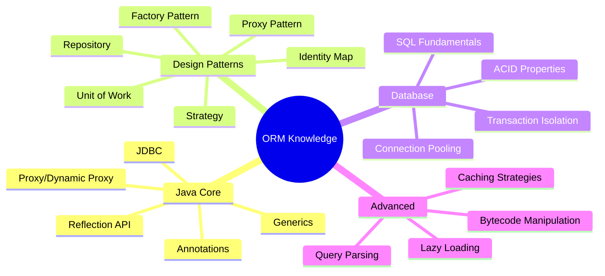
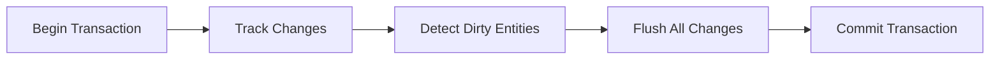
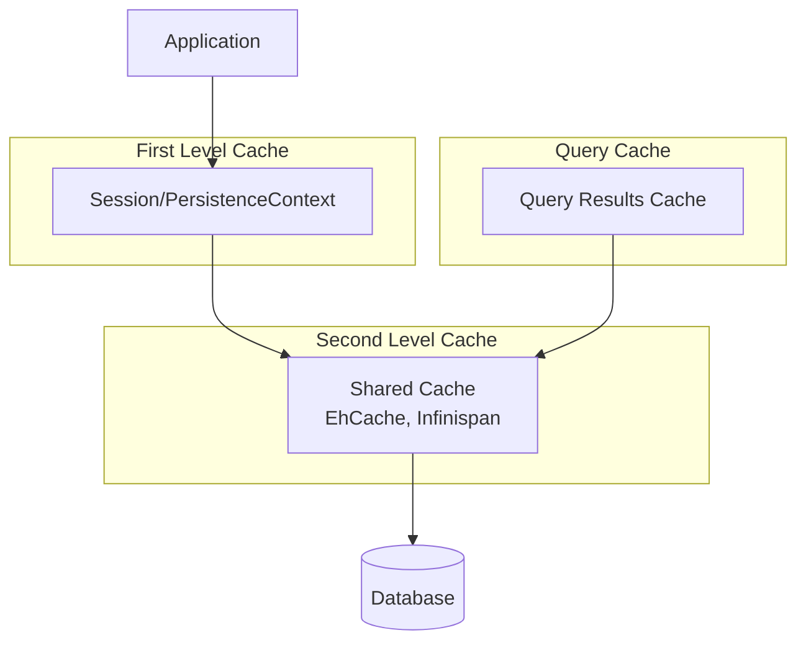
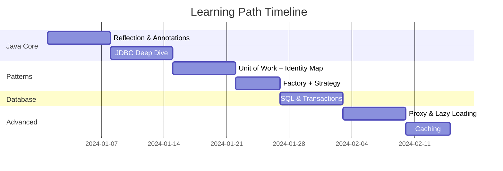

# 🧠 Kiến Thức Cần Có Để Implement ORM

## 📋 Tổng quan



---

## 1️⃣ Java Core

### 1.1 Reflection API ⭐⭐⭐

**Tại sao cần?** ORM cần inspect class structure ở runtime để:
- Đọc annotations
- Get/set field values
- Invoke constructors

```java
// Ví dụ: Lấy tất cả fields của một class
Class<?> clazz = User.class;

// Lấy giá trị field
Field field = clazz.getDeclaredField("name");
field.setAccessible(true);
Object value = field.get(userInstance);

// Set giá trị
field.set(userInstance, "New Name");

// Đọc annotation
Entity entityAnnotation = clazz.getAnnotation(Entity.class);
String tableName = entityAnnotation.table();
```

**Cần học:**
- `Class<?>`, `Field`, `Method`, `Constructor`
- `getDeclaredFields()` vs `getFields()`
- `setAccessible(true)` để access private fields
- Performance implications của reflection

### 1.2 Annotations ⭐⭐⭐

**Tại sao cần?** Định nghĩa metadata cho entity classes.

```java
// Tạo custom annotation
@Retention(RetentionPolicy.RUNTIME) // Quan trọng! Để đọc được lúc runtime
@Target(ElementType.TYPE)
public @interface Entity {
    String table() default "";
}

// Annotation với methods
@Retention(RetentionPolicy.RUNTIME)
@Target(ElementType.FIELD)
public @interface Column {
    String name() default "";
    boolean nullable() default true;
    int length() default 255;
}
```

**Cần học:**
- `@Retention` policies (SOURCE, CLASS, RUNTIME)
- `@Target` element types
- Annotation methods và default values
- Meta-annotations

### 1.3 Generics ⭐⭐

**Tại sao cần?** Type-safe APIs.

```java
public interface Repository<T, ID> {
    T findById(ID id);
    List<T> findAll();
    void save(T entity);
}

public class GenericDao<T> {
    private Class<T> entityClass;
    
    @SuppressWarnings("unchecked")
    public GenericDao() {
        // Lấy generic type parameter lúc runtime
        Type type = getClass().getGenericSuperclass();
        ParameterizedType pt = (ParameterizedType) type;
        this.entityClass = (Class<T>) pt.getActualTypeArguments()[0];
    }
}
```

### 1.4 JDBC ⭐⭐⭐

**Tại sao cần?** Layer thấp nhất để interact với database.

```java
// Connection management
Connection conn = DriverManager.getConnection(url, user, password);

// PreparedStatement (ALWAYS use this, never Statement)
String sql = "INSERT INTO users (name, email) VALUES (?, ?)";
PreparedStatement ps = conn.prepareStatement(sql, 
    Statement.RETURN_GENERATED_KEYS);
ps.setString(1, "John");
ps.setString(2, "john@example.com");
ps.executeUpdate();

// Get auto-generated ID
ResultSet rs = ps.getGeneratedKeys();
if (rs.next()) {
    Long id = rs.getLong(1);
}

// Query và map results
ps = conn.prepareStatement("SELECT * FROM users WHERE id = ?");
ps.setLong(1, id);
ResultSet rs = ps.executeQuery();
while (rs.next()) {
    String name = rs.getString("name");
    String email = rs.getString("email");
}

// Transaction
conn.setAutoCommit(false);
try {
    // operations
    conn.commit();
} catch (SQLException e) {
    conn.rollback();
}
```

**Cần học:**
- Connection, Statement, PreparedStatement, ResultSet
- Resource management (try-with-resources)
- Batch operations
- Transaction handling

### 1.5 Proxy / Dynamic Proxy ⭐⭐

**Tại sao cần?** Lazy loading entities.

```java
public interface UserService {
    void doSomething();
}

// Dynamic Proxy
InvocationHandler handler = (proxy, method, args) -> {
    System.out.println("Before: " + method.getName());
    Object result = method.invoke(realObject, args);
    System.out.println("After: " + method.getName());
    return result;
};

UserService proxy = (UserService) Proxy.newProxyInstance(
    UserService.class.getClassLoader(),
    new Class<?>[] { UserService.class },
    handler
);
```

**Limitations:** Java Proxy chỉ works với interfaces. Hibernate dùng Bytecode manipulation (ByteBuddy/CGLIB) cho classes.

---

## 2️⃣ Design Patterns

### 2.1 Factory Pattern ⭐⭐⭐

**Usage:** SessionFactory creates Session instances.

```java
public class MiniSessionFactory {
    private final Configuration config;
    
    public MiniSession openSession() {
        Connection conn = dataSource.getConnection();
        return new MiniSession(conn, this);
    }
}
```

### 2.2 Unit of Work ⭐⭐⭐

**Usage:** Session tracks changes và batch writes.



```java
public class UnitOfWork {
    private Set<Object> newObjects = new HashSet<>();
    private Set<Object> dirtyObjects = new HashSet<>();
    private Set<Object> removedObjects = new HashSet<>();
    
    public void registerNew(Object entity) {
        newObjects.add(entity);
    }
    
    public void commit() {
        // INSERT new
        // UPDATE dirty
        // DELETE removed
    }
}
```

### 2.3 Identity Map ⭐⭐⭐

**Usage:** Ensure one entity instance per session.

```java
public class IdentityMap {
    private Map<EntityKey, Object> entities = new HashMap<>();
    
    public Object get(EntityKey key) {
        return entities.get(key);
    }
    
    public void put(EntityKey key, Object entity) {
        entities.put(key, entity);
    }
}

// Đảm bảo:
User user1 = session.find(User.class, 1L);
User user2 = session.find(User.class, 1L);
assert user1 == user2; // Same instance!
```

### 2.4 Repository Pattern ⭐⭐

**Usage:** Abstract data access logic.

```java
public interface UserRepository {
    User findById(Long id);
    List<User> findByEmail(String email);
    void save(User user);
}
```

### 2.5 Strategy Pattern ⭐⭐

**Usage:** Different SQL dialects for different databases.

```java
public interface SQLDialect {
    String getLimitClause(int limit);
    String getIdentityColumn();
}

public class MySQLDialect implements SQLDialect {
    public String getLimitClause(int limit) {
        return "LIMIT " + limit;
    }
}

public class PostgreSQLDialect implements SQLDialect {
    public String getLimitClause(int limit) {
        return "LIMIT " + limit;
    }
}
```

---

## 3️⃣ Database Knowledge

### 3.1 SQL Fundamentals ⭐⭐⭐

```sql
-- CRUD
INSERT INTO users (name, email) VALUES ('John', 'john@example.com');
SELECT * FROM users WHERE id = 1;
UPDATE users SET name = 'Jane' WHERE id = 1;
DELETE FROM users WHERE id = 1;

-- Joins (cho relationships)
SELECT u.*, o.* 
FROM users u 
JOIN orders o ON u.id = o.user_id
WHERE u.id = 1;

-- Aggregations
SELECT COUNT(*), department_id 
FROM employees 
GROUP BY department_id;
```

### 3.2 ACID Properties ⭐⭐

| Property | Meaning | How ORM handles |
|----------|---------|-----------------|
| Atomicity | All or nothing | Transaction wraps operations |
| Consistency | Valid state | Constraints, validation |
| Isolation | Concurrent access | Isolation levels |
| Durability | Persisted | Commit to disk |

### 3.3 Transaction Isolation Levels ⭐⭐

```java
connection.setTransactionIsolation(Connection.TRANSACTION_READ_COMMITTED);
```

| Level | Dirty Read | Non-repeatable Read | Phantom Read |
|-------|------------|---------------------|--------------|
| READ_UNCOMMITTED | ✓ | ✓ | ✓ |
| READ_COMMITTED | ✗ | ✓ | ✓ |
| REPEATABLE_READ | ✗ | ✗ | ✓ |
| SERIALIZABLE | ✗ | ✗ | ✗ |

### 3.4 Connection Pooling ⭐⭐

**Tại sao?** Tạo connection expensive. Pool và reuse.

```java
// HikariCP example
HikariConfig config = new HikariConfig();
config.setJdbcUrl("jdbc:h2:mem:test");
config.setMaximumPoolSize(10);
config.setMinimumIdle(5);

DataSource dataSource = new HikariDataSource(config);
```

---

## 4️⃣ Advanced Topics

### 4.1 Bytecode Manipulation ⭐

**Tại sao?** Proxy cho classes (không phải interfaces).

**Libraries:**
- **ByteBuddy** - Modern, fluent API
- **CGLIB** - Older, used by older Hibernate
- **Javassist** - Used in some frameworks

```java
// ByteBuddy example
Class<?> dynamicClass = new ByteBuddy()
    .subclass(User.class)
    .method(ElementMatchers.any())
    .intercept(MethodDelegation.to(new LazyLoadingInterceptor()))
    .make()
    .load(getClass().getClassLoader())
    .getLoaded();
```

### 4.2 Caching Strategies ⭐⭐



### 4.3 Lazy vs Eager Loading ⭐⭐

```java
// Eager - load immediately
@ManyToOne(fetch = FetchType.EAGER)
private Department department;

// Lazy - load when accessed
@OneToMany(fetch = FetchType.LAZY, mappedBy = "user")
private List<Order> orders;

// N+1 Problem
List<User> users = session.findAll(User.class); // 1 query
for (User user : users) {
    user.getOrders().size(); // N queries!
}

// Solution: JOIN FETCH
@Query("SELECT u FROM User u JOIN FETCH u.orders")
List<User> findAllWithOrders();
```

---

## 🎯 Learning Priority

| Priority | Topic | Why |
|----------|-------|-----|
| 1 | JDBC | Foundation of all DB access |
| 2 | Reflection | Core of ORM mapping |
| 3 | Annotations | Metadata definition |
| 4 | Unit of Work | Session behavior |
| 5 | Identity Map | Caching behavior |
| 6 | SQL | Query generation |
| 7 | Transactions | Data consistency |
| 8 | Proxy | Lazy loading |
| 9 | Connection Pool | Performance |
| 10 | Bytecode | Advanced proxies |

---

## 📚 Recommended Learning Path



---

## 🔗 Resources

### Books
1. "Patterns of Enterprise Application Architecture" - Martin Fowler
   - Unit of Work, Identity Map, Data Mapper patterns

2. "Effective Java" - Joshua Bloch
   - Best practices for annotations, generics

### Online Courses
1. [JDBC Tutorial](https://www.baeldung.com/java-jdbc)
2. [Java Reflection](https://www.baeldung.com/java-reflection)
3. [Hibernate Internals](https://vladmihalcea.com/tutorials/hibernate/)

### Code to Study
1. [Hibernate ORM](https://github.com/hibernate/hibernate-orm)
2. [MyBatis](https://github.com/mybatis/mybatis-3)
3. [Ebean ORM](https://github.com/ebean-orm/ebean) - Simpler to read
