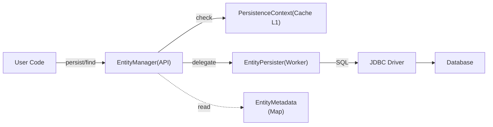

# Kiến Trúc Mini-Hibernate JPA

Tài liệu này giải thích cách chúng ta xây dựng một bản JPA đơn giản ("mini-hibernate") để bạn hiểu rõ luồng đi và lý do tại sao cần các class này. Chúng ta không làm phức tạp như EclipseLink hay Hibernate thật, mà tập trung vào cốt lõi để dễ học.

## 1. Bức Tranh Tổng Thể (The Big Picture)

Khi bạn gọi `em.persist(entity)` hoặc `em.find(...)`, luồng dữ liệu đi như sau:

## 2. Các Class Chính & Tại Sao Cần Chúng?

Để support JPA, ta cần implement các thành phần sau. Hãy tưởng tượng đây là một dây chuyền sản xuất:

### A. Khởi Động (Bootstrapping)

**Class:** `MiniPersistenceProvider` -> `MiniEntityManagerFactory`

- **Nhiệm vụ:** Đọc file cấu hình (hoặc code config), kết nối Database, và quét (scan) các Entity class.
- **Tại sao cần?**
  - JPA chuẩn (`jakarta.persistence`) cần một điểm vào (`Provider`) để biết ai sẽ xử lý database.
  - Factory cần được tạo 1 lần duy nhất (Singleton) vì nó rất nặng (nó phải tạo Metadata cho toàn bộ hệ thống).

### B. Bộ Não (Metadata System)

**Class:** `MetadataParser` -> `EntityMetadata` -> `FieldMetadata`

- **Nhiệm vụ:** Đọc annotations (`@Entity`, `@Table`, `@Column`, `@ManyToOne`) trên class Java của bạn và lưu lại vào bộ nhớ.
- **Tại sao cần?**
  - Để không phải dùng Reflection quét lại annotation mỗi lần chạy câu SQL (chậm).
  - **Ví dụ:** Khi bạn gọi `find(User.class, 1)`, hệ thống cần biết `User` map vào bảng nào (`users`), và cột ID tên là gì (`id` hay `user_id`). `EntityMetadata` trả lời câu hỏi đó ngay lập tức.
  - **Metamodel là gì?** Nó là phiên bản chuẩn hóa của Metadata mà JPA lộ ra cho User dùng (ví dụ: dùng trong Criteria API). Trong mini-hibernate, ta dùng `EntityMetadata` (nội bộ) đơn giản hơn nhiều.

### C. Phiên Làm Việc (The Session)

**Class:** `MiniEntityManagerImpl`

- **Nhiệm vụ:** Là giao diện chính bạn dùng. Nó quản lý một "Unit of Work" (một giao dịch nghiệp vụ).
- **Tại sao cần?**
  - **Unit of Work:** Bạn sửa đổi 10 object, EntityManager sẽ nhớ hết, và chỉ lưu 1 lần khi gọi `commit`.
  - **Identity Map (PersistenceContext):** Nó đảm bảo nếu bạn load User ID=1 hai lần trong cùng một transaction, bạn nhận được **cùng một object Java**. Điều này cực quan trọng để đảm bảo tính nhất quán dữ liệu.

### D. Người Thực Thi (The Worker)

**Class:** `EntityPersister` & `SQLGenerator`

- **Nhiệm vụ:** Chuyển đổi từ Object sang SQL và ngược lại.
- **Tại sao cần?**
  - `EntityManager` chỉ quản lý trạng thái Object (New, Managed, Removed). Nó không biết viết SQL.
  - `EntityPersister` sẽ lấy thông tin từ `EntityMetadata` (tên bảng, tê cột) để viết câu `INSERT INTO...` hoặc `SELECT...` và bắn xuống JDBC.
  - **Khác biệt với Hibernate thật:** Hibernate thật có `Dialect` để hỗ trợ nhiều DB (MySQL, Oracle...). Ta làm đơn giản chỉ hỗ trợ H2/MySQL cơ bản.

## 3. Luồng Chạy Cụ Thể (Ví dụ)

Giả sử bạn có class `Employee` (@ManyToOne `Department`).

### Kịch bản 1: `em.persist(employee)`

1.  **User** gọi `persist(employee)`.
2.  **EntityManager** kiểm tra xem `employee` đã có ID chưa?
3.  **EntityManager** đưa `employee` vào `PersistenceContext` (đánh dấu là `MANAGED`).
4.  **Chưa có SQL nào chạy cả!** (Đây gọi là Write-behind).
5.  **User** gọi `transaction.commit()`.
6.  **EntityManager** gọi `flush()`.
7.  **EntityManager** bảo **EntityPersister**: "Lưu thằng này đi".
8.  **EntityPersister** nhìn vào `EntityMetadata`:
    - "À, field `department` là @ManyToOne".
    - "Lấy ID của department ra (ví dụ: 10)".
    - Tạo SQL: `INSERT INTO Employee (name, department_id) VALUES ('Hai', 10)`.

### Kịch bản 2: `em.find(Employee.class, 1)` (Relation Eager Loading)

1.  **User** gọi `find`.
2.  **EntityManager** kiểm tra Cache L1. Nếu không có -> gọi **EntityPersister**.
3.  **EntityPersister** chạy `SELECT * FROM Employee WHERE id = 1`.
4.  Có kết quả ResultSet.
5.  **EntityPersister** bắt đầu map dữ liệu vào object `Employee`:
    - Thấy cột `department_id = 10`.
    - Field `department` là Entity. Cần convert số 10 thành Object `Department`.
    - **EntityPersister** gọi ngược lại `EntityManager.find(Department.class, 10)`.
    - **EntityManager** trả về object Department (có thể từ cache hoặc load DB tiếp).
    - Gán object Department vào Employee.
6.  Trả về `Employee` hoàn chỉnh.

## 4. Bắt Đầu Từ Đâu?

Nếu bạn muốn học code này, hãy đọc theo thứ tự sau:

1.  **`MiniPersistenceProvider.java`**: Xem cách nó khởi tạo Factory.
2.  **`EntityMetadata.java`**: Xem nó lưu trữ cái gì (tên bảng, danh sách cột).
3.  **`EntityPersister.java`**: Xem cách nó tạo SQL (đây là phần "thịt" nhất của ORM).
4.  **`MiniEntityManagerImpl.java`**: Xem cách nó phối hợp Cache (`PersistenceContext`) và Persister.

JPA không có gì ma thuật cả, nó chỉ là **Metadata (Cấu hình) + Reflection (Đọc/Ghi field) + JDBC generation (Sinh SQL)**.
