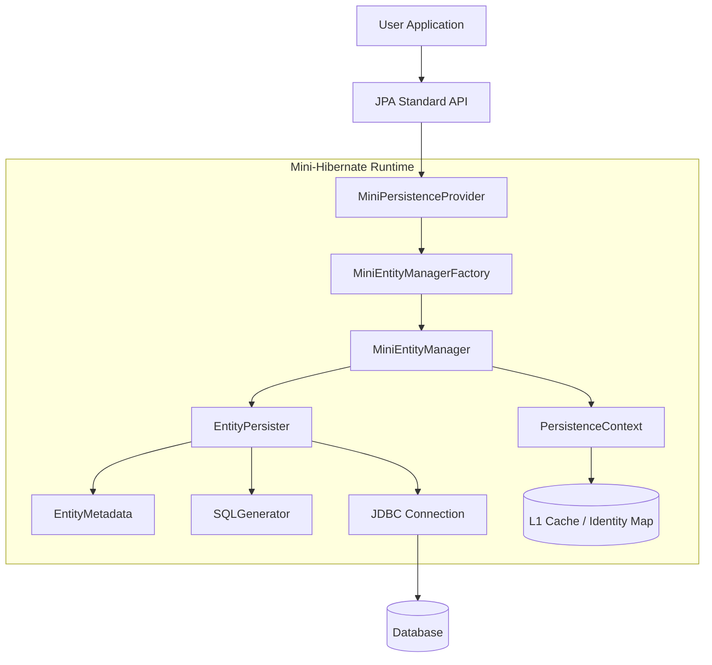
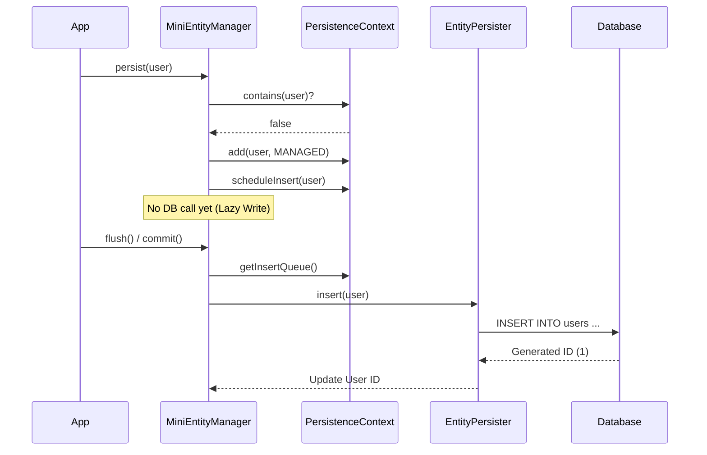
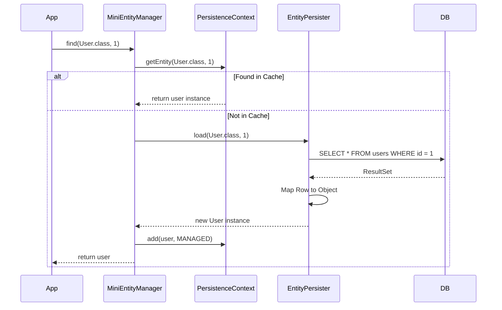

# Mini-Hibernate JPA Implementation Summary

This document outlines the architectural decisions, design patterns, and technical strategies used to implement a lightweight JPA provider for `mini-hibernate`.

## 1. High-Level Architecture

The architecture follows the standard JPA specification, dividing responsibilities into distinct layers: **Bootstrapping**, **Runtime Management**, and **Persistence Operations**.



## 2. Key Techniques & Design Patterns

### A. Service Provider Interface (SPI)

**Pattern:** `SPI` (Java Service Provider Interface)  
**Implementation:** `MiniPersistenceProvider`  
**How it works:**  
Java's `ServiceLoader` mechanism discovers our provider via `META-INF/services/jakarta.persistence.spi.PersistenceProvider`. When `Persistence.createEntityManagerFactory(...)` is called, it iterates through implementations. Our provider checks if it's the requested one and bootstraps the environment.

### B. Factory Pattern

**Pattern:** `Abstract Factory`  
**Implementation:** `MiniEntityManagerFactoryImpl`  
**How it works:**  
Clients don't instantiate `EntityManager` directly. The factory encapsulates the complex setup logic (DataSource creation, Metadata parsing, Connection pooling) and produces ready-to-use `MiniEntityManager` instances. This ensures expensive resources (like the Connection Pool) are initialized once and shared.

### C. Functional Programming with Vavr

**Technique:** Functional Combinators & Immutable Collections  
**Implementation:** Throughout the core logic (`MiniMetamodelImpl`, `MiniEntityManagerImpl`).  
**How it works:**  
Instead of traditional imperative Java with null checks and exceptions, we use **Vavr**:

- **`Option<T>`**: Handles values that might be missing (e.g., finding an entity), avoiding `NullPointerException`.
- **`Try<T>`**: Encapsulates operations that can fail (e.g., Reflection, Database calls), allowing functional error handling chaining (`.map().getOrElseThrow()`).
- **`io.vavr.collection.Map/Set`**: Immutable collections that make state management in the Metamodel safer and thread-safe.

_Example (Metamodel Lookup):_

```java
// Functional style: Fluent, safe, and expressive
return entities.values()
    .find(e -> e.getName().equals(name))
    .map(e -> (EntityType<?>) e)
    .getOrElseThrow(() -> new IllegalArgumentException("Not found"));
```

### D. Composite Pattern (Metamodel)

**Pattern:** `Composite` / `Type Hierarchy`  
**Implementation:** `MiniTypeImpl`, `MiniManagedTypeImpl`, `MiniEntityTypeImpl`  
**How it works:**  
Instead of flat classes or dynamic proxies (which are fragile), we built a robust class hierarchy to represent the JPA Metamodel.

- `Type`: Base interface.
- `ManagedType`: Adds attribute management.
- `EntityType`: Adds Identity and Versioning capabilities.
  This allows strictly typed reflection and validation of entity structures at runtime.

### E. Unit of Work & Identity Map

**Pattern:** `Unit of Work` & `Identity Map`  
**Implementation:** `PersistenceContext`  
**How it works:**

- **Identity Map (L1 Cache)**: Ensures that within a single `EntityManager` session, loading the same ID multiple times returns the exact same Java object instance.
- **Unit of Work**: Tracks changes (`INSERT`, `UPDATE`, `DELETE`) to managed objects. When `flush()` or `commit()` is called, it calculates the net changes and synchronizes with the database in a transaction, minimizing DB trips.

## 3. Workflow Explanations

### Bootstrapping (`createEntityManagerFactory`)

1.  **Discovery**: Spring/User calls `Persistence.createEntityManagerFactory`.
2.  **Validation**: `MiniPersistenceProvider` checks if the requested persistence unit matches.
3.  **Parsing**: Reads `persistence.xml` (or Spring config) to find Entity classes and DB properties.
4.  **Metadata Construction**: Scans Entity classes using Reflection to build `EntityMetadata`, mapping Java fields to SQL columns.
5.  **Initialization**: Starts the `HikariCP` connection pool and returns the Factory.

### Persisting an Entity (`persist`)



### Finding an Entity (`find`)



## 4. Current Limitations

- **Native Query Mapping**: Custom native queries return raw `Object[]` instead of mapped Entities.
- **JPQL**: No support for Java Persistence Query Language parsing yet.
- **Lazy Loading**: Relationships are currently Eager or manually resolved; Proxies for lazy loading are not implemented.
