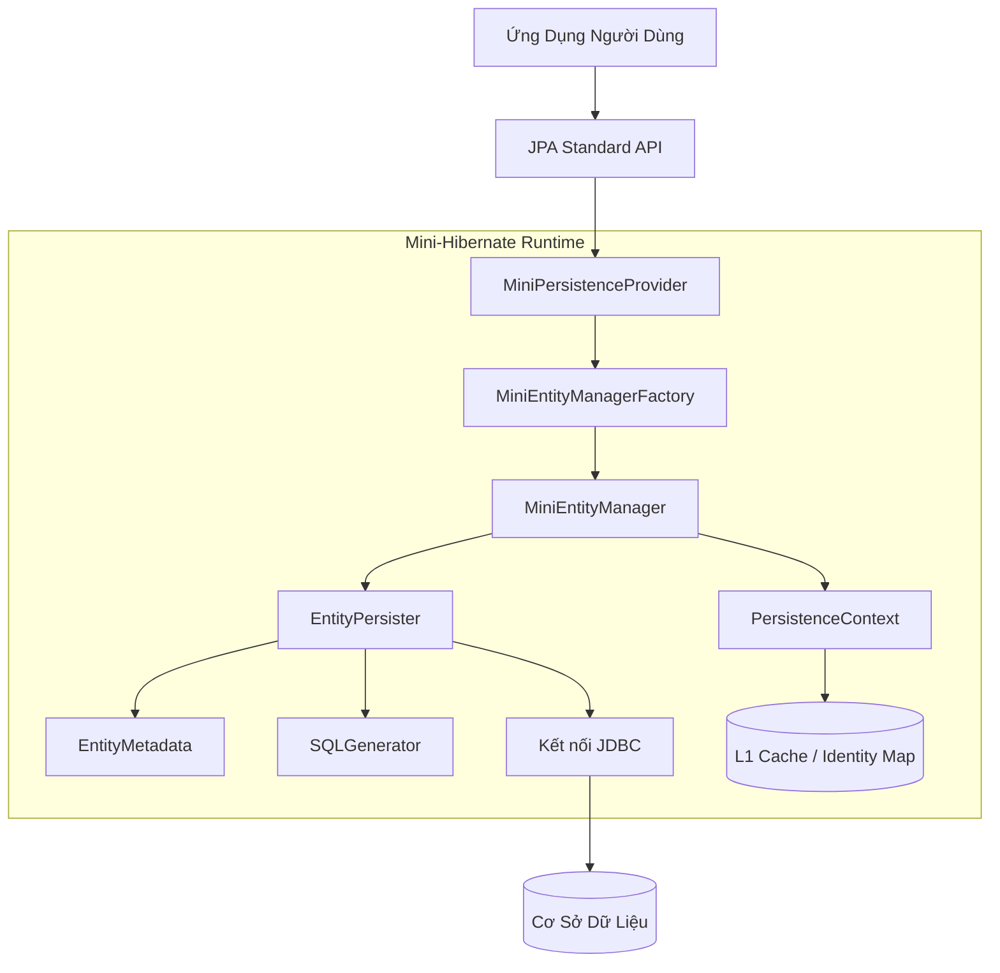
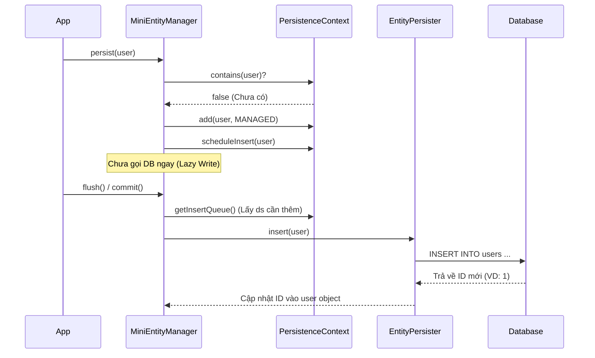
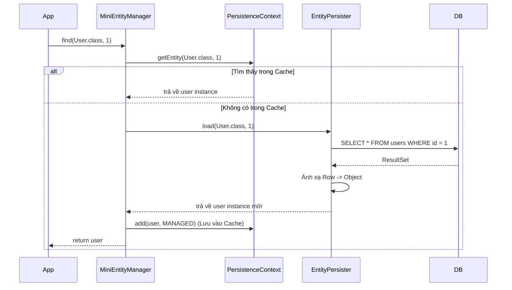

# Tổng Quan Kiến Trúc Implementation JPA của Mini-Hibernate

Tài liệu này dịch và mở rộng từ phiên bản tiếng Anh, giải thích các quyết định kiến trúc, các mẫu thiết kế (design patterns) và chiến lược kỹ thuật dùng để xây dựng JPA provider cho `mini-hibernate`.

## 1. Kiến Trúc Tổng Quan (High-Level Architecture)

Kiến trúc tuân theo chuẩn JPA, chia trách nhiệm thành 3 tầng: **Bootstrapping** (Khởi động), **Runtime Management** (Quản lý Runtime), và **Persistence Operations** (Thao tác dữ liệu).

## 2. Kỹ Thuật Chính & Design Patterns

### A. Service Provider Interface (SPI)

**Pattern:** `SPI` (Java Service Provider Interface)  
**Cài đặt:** `MiniPersistenceProvider`  
**Cơ chế:**  
Java sử dụng cơ chế `ServiceLoader` để tìm kiếm implementation thông qua file `META-INF/services/jakarta.persistence.spi.PersistenceProvider`. Khi người dùng gọi `Persistence.createEntityManagerFactory(...)`, Java sẽ duyệt qua các provider đã đăng ký. Provider của chúng ta sẽ kiểm tra xem nó có phải là đơn vị được yêu cầu không và tiến hành khởi tạo môi trường.

### B. Factory Pattern

**Pattern:** `Abstract Factory`  
**Cài đặt:** `MiniEntityManagerFactoryImpl`  
**Cơ chế:**  
Client không bao giờ khởi tạo trực tiếp `EntityManager`. Factory đóng gói toàn bộ logic khởi tạo phức tạp (tạo DataSource, đọc/parse cấu hình, tạo Connection Pool) và cung cấp các instance `MiniEntityManager` đã sẵn sàng sử dụng. Việc này đảm bảo các tài nguyên nặng (như Connection Pool) chỉ được tạo một lần và chia sẻ dùng chung.

### C. Functional Programming với Vavr

**Kỹ thuật:** Functional Combinators & Immutable Collections  
**Cài đặt:** Sử dụng xuyên suốt trong `MiniMetamodelImpl`, `MiniEntityManagerImpl`.  
**Cơ chế:**  
Thay vì viết code Java truyền thống với nhiều bước kiểm tra null (`if (x != null)`), chúng ta dùng **Vavr**:

- **`Option<T>`**: Xử lý các giá trị có thể bị thiếu (ví dụ: tìm entity nhưng không thấy), tránh lỗi `NullPointerException`.
- **`Try<T>`**: Bao đóng các thao tác có thể gây lỗi (ví dụ: Reflection, gọi vào DB), cho phép xử lý lỗi theo chuỗi (`map()`, `getOrElseThrow()`) rất gọn gàng.
- **`io.vavr.collection.Map/Set`**: Các cấu trúc dữ liệu bất biến (immutable) giúp việc quản lý trạng thái của Metamodel an toàn hơn, đặc biệt trong môi trường đa luồng.

### D. Composite Pattern (Metamodel Hierarchy)

**Pattern:** `Composite` / `Type Hierarchy`  
**Cài đặt:** `MiniTypeImpl`, `MiniManagedTypeImpl`, `MiniEntityTypeImpl`  
**Cơ chế:**  
Thay đổi lớn nhất so với phiên bản cũ là thay vì dùng Proxy động (dễ lỗi), ta xây dựng hệ thống phân cấp class rõ ràng:

- `Type`: Interface cơ sở.
- `ManagedType`: Quản lý các thuộc tính (attribute).
- `EntityType`: Thêm khả năng định danh (ID) và versioning.
  Điều này giúp việc kiểm tra kiểu dữ liệu (reflection) chặt chẽ và an toàn hơn tại thời điểm chạy (runtime).

### E. Unit of Work & Identity Map

**Pattern:** `Unit of Work` & `Identity Map`  
**Cài đặt:** `PersistenceContext`  
**Cơ chế:**

- **Identity Map (L1 Cache)**: Đảm bảo rằng trong cùng một phiên làm việc (`EntityManager`), nếu load cùng một ID nhiều lần thì luôn trả về **cùng một object Java duy nhất**.
- **Unit of Work**: Theo dõi sự thay đổi (`INSERT`, `UPDATE`, `DELETE`) của các object. Khi gọi `flush()` hoặc `commit()`, nó mới tính toán những gì cần thay đổi và đẩy xuống DB một lần duy nhất, giảm thiểu số lần gọi DB.

---

## 3. Giải Thích Chi Tiết Gói `org.ltl.minihibernate.internal`

Phần này đi sâu vào giải thích các class cốt lõi mà bạn tò mò, đặc biệt là Metamodel.

### Các Class Quản Lý Runtime (`internal`)

1.  **`MiniEntityManagerFactoryImpl`**:
    - Giữ tham chiếu toàn cục đến `DataSource` (kết nối DB) và `Metamodel` (thông tin về các Entity).
    - Tạo ra các `MiniEntityManagerImpl`. Đây là object sống lâu nhất trong ứng dụng.

2.  **`MiniEntityManagerImpl`**:
    - Đây là "trái tim" của mọi phiên làm việc. Nó quản lý vòng đời của Entity.
    - Sở hữu một `PersistenceContext` riêng để làm bộ nhớ tạm (L1 Cache).
    - Chuyển tiếp các lệnh DB xuống cho `EntityPersister`.

3.  **`MiniTypedQueryImpl` & `MiniNativeQueryImpl`**:
    - Đại diện cho các câu truy vấn. `TypedQuery` dùng cho câu lệnh JPQL (hiện tại mới chỉ hỗ trợ cơ bản), còn `NativeQuery` dùng cho SQL thuần.
    - **Lưu ý**: `MiniNativeQueryImpl` hiện tại hoạt động ở mức JDBC thuần túy, chưa mapping kết quả về Entity object một cách tự động.

### Hệ Thống Metamodel (`internal.metamodel`)

Đây là phần mô tả "siêu dữ liệu" (metadata) về các Entity class của bạn. Tại sao lại cần nó? JPA cần biết class nào là Entity, trường nào là ID, trường nào là cột bình thường mà không cần phải dùng Reflection liên tục (vì Reflection rất chậm).

1.  **`MiniMetamodelImpl`**:
    - Là kho chứa tổng hợp. Nó chứa danh sách tất cả các `Entity` đã được đăng ký.
    - Khi ứng dụng khởi động, nó quét qua các class, đọc annotation (`@Entity`, `@Id`...) một lần duy nhất, xây dựng nên cây cấu trúc dữ liệu và lưu vào đây.

2.  **Hệ thống phân cấp (`MiniType` Hierarchy)**:
    - **`MiniTypeImpl`**: Class cha, đại diện cho một kiểu dữ liệu Java bất kỳ (int, String, User...).
    - **`MiniManagedTypeImpl` (extends Type)**: Đại diện cho các kiểu dữ liệu "được quản lý" (có chứa các thuộc tính). Ví dụ: Class `User` là một ManagedType vì nó có các field `id`, `name`.
      - Nó chứa một `Map<String, Attribute>` để lưu danh sách các trướng (field) của class đó.
    - **`MiniIdentifiableTypeImpl` (extends ManagedType)**: Đại diện cho các kiểu có định danh (ID). Hầu hết Entity đều thuộc loại này.
      - Nó biết trường nào là `@Id` và trường nào là `@Version`.
    - **`MiniEntityTypeImpl` (extends IdentifiableType)**: Là implementation cụ thể cho `@Entity`.
      - Ví dụ: Class cấu hình cho `User` sẽ là một instance của `MiniEntityTypeImpl`. Khi bạn gọi `metamodel.entity(User.class)`, bạn nhận được object này.

3.  **Hệ thống thuộc tính (`Attribute` Hierarchy)**:
    - **`MiniAttributeImpl`**: Đại diện cho một field trong Java class (ví dụ `private String name`).
    - **`MiniSingularAttributeImpl`**: Đại diện cho field đơn trị (String, Long, int).
    - _(Tương lai sẽ có `MiniPluralAttributeImpl` cho List, Set...)_

--> **Tóm lại**: Metamodel là bản đồ chỉ dẫn cho Hibernate biết cách ánh xạ từ Java Object sang bảng Database. Việc chúng ta dùng Vavr và phân cấp class rõ ràng giúp bản đồ này cực kỳ chính xác và khó bị lỗi logic.

---

## 4. Luồng Hoạt Động (Workflows)

### Lưu dữ liệu (`persist`)

### Tìm dữ liệu (`find`)

## 5. Hạn Chế Hiện Tại

- **Native Query Mapping**: SQL thuần chỉ trả về `Object[]`, chưa tự map sang `User` object được.
- **JPQL**: Chưa bộ parser cho ngôn ngữ truy vấn JPQL.
- **Lazy Loading**: Các quan hệ (Relationships) đang load theo kiểu Eager (lấy hết ngay lập tức).
